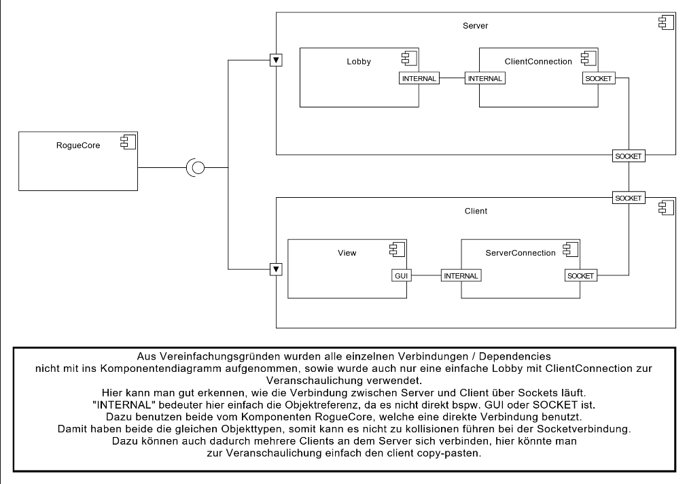
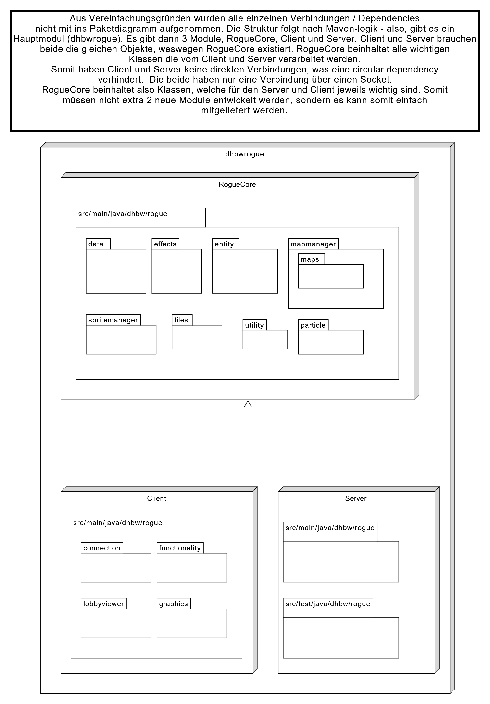
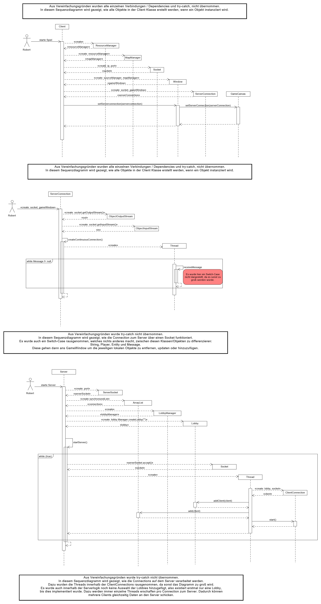

# Einführung und Ziele
Ein Softwareprojekt soll in der gegebenen Zeit von zwei Semestern nach Software Engineering Standards umgesetzt werden
## Aufgabenstellung
Es soll ein Roguelike-Spiel auf Java Basis entwickelt werden. Dieses soll es bis zu 4 Spielern ermöglichen eine Lobby zu erstellen/beizutreten, mit anderen Spielern in einer Lobby zu interagieren, Dungeons zu erkunden und dabei Gegner zu bekämpfen, sowie das Sammeln und Nutzen von Gegenständen. Treibende Kräfte sind dabei unsere eigene Motivation ein gutes Produkt zu erstellen, langfristig gesehen auch eine gute Note.
Verweis:
- SRS: https://github.com/RodProgrammer/dhbwrogue/blob/main/docs/SRS.md

## Qualitätsziele
| Priorität | Qualitätsziel   | Beschreibung                                                                 | Konkretes Szenario |
|----------:|------------------|------------------------------------------------------------------------------|--------------------|
| 1 | Wartbarkeit | Änderungen am Spiel sollen mit geringem Aufwand verbunden sein. | Ein Entwickler ändert die Lebenspunkte eines Gegners. Diese Änderung soll nur diesen Gegner betreffen und nicht zusätzlich Bewegung oder Verhalten des Gegners. Der Aufwand soll auf wenige abgegrenzte Klassen beschränkt bleiben. |
| 2 | Erweiterbarkeit | Neue Inhalte sollen leicht ergänzt werden können. | Dem Spiel soll ein neuer Gegnertyp mit Spezialfähigkeit hinzugefügt werden. Dies soll möglich sein, indem eine neue Klasse ergänzt wird, ohne Änderungen an anderer Stelle vornehmen zu müssen. |
| 3 | Performance | Das Spiel soll bei größeren Karten auch auf älteren Rechnern flüssig laufen. | Auf einer großen Dungeon-Ebene mit 50 Gegnern soll das Spielen ohne spürbare Verzögerung erfolgen. |

## Stakeholder
| Rolle | Kontakt | Erwartungshaltung |
|------|---------|-------------------|
| Entwickler-Team | Projektmitglieder | Erwartet klare und wartbare Architektur, damit Features einfach umgesetzt und bestehende Funktionen sicher geändert werden können. |
| SCRUM-Master | Projektkoordination | Erwartet eine gut strukturierte Architektur, damit Aufgaben sauber aufgeteilt werden und bearbeitet werden können. |
| Dozent | Dozent | Erwartet eine sauber dokumentierte Architektur, bei der Entscheidungen klar erkenn- und nachvollziehbar sind. |

# Randbedingungen
| Kategorie | Randbedingung | Erläuterung |
|----------|---------------|-------------|
| Technisch | Implementierung in Java | Die Software soll in Java entwickelt werden. Dadurch sind Bibliotheken eingeschränkt. |
| Technisch | Desktop-Anwendung | Das Spiel wird als lokale Anwendung auf einem Rechner ausgeführt und nicht als bspw. Webanwendung bereitgestellt. |
| Organisatorisch | Scrum wird angewandt | Die Entwicklung erfolgt in Sprints, daher müssen Änderungen/Erweiterungen gut integrierbar sein. |
| Übergreifende Konvention | Versionierung mit Git | Der Code muss versionierbar sein. |

# Kontextabgrenzung
Das System umfasst das eigentliche Roguelike-Spiel mit folgenden Elementen:
- Spiellogik
- Darstellung
- Eingabeverarbeitung
- Gegnerverhalten
- Verwaltung des Spielzustands

Nicht Teil des Systems sind das Betriebssystem, die Java-Laufzeitumgebung sowie die Eingabegeräte selbst.
Externe Kommunikationspartner sind:
- Spieler 
- Betriebs- und Dateisystem
- Eingabegeräte wie Tastatur, etc.

## Fachlicher Kontext
| Kommunikationsbeziehung | Eingabe | Ausgabe |
|-------------------------|---------|---------|
| Spieler -> Spiel | Bewegungen, Interaktionen | Spielreaktionen, Spielfortschritt |
| Spiel <-> Dateisystem | Ladeanfrage, Speicheranfrage | Spielstände |
| Spiel -> Spieler | Darstellung von Map, Gegnern, Inventar, anderen Effekten | Spielgeschehen |

Beschreibung: Das Spiel verarbeitet Eingaben des Spielers und aktualisiert auf dieser Basis den Spielzustand und gibt die veränderte Spielsituation wieder aus. Zusätzlich können Spielstände gespeichert und geladen werden. 

## Technischer Kontext
| Kommunikationsbeziehung | Kanal | Beschreibung |
|-------------------------|-------|--------------|
| Spieler <-> Spiel | Tastatur | Der Spieler steuert das Spiel über Tastatureingaben. |
| Spiel -> Anzeige | Grafikbibliothek | Das Spiel wird in einem Fenster auf dem Bildschirm dargestellt. |
| Spiel <-> Dateisystem | Dateizugriff über Java | Speicherung und Laden von Spielständen oder Konfigurationsdateien. |
| Spiel <-> Betriebssystem | JVM/Betriebssystem | Das Spiel läuft auf der Java Virtual Machine und nutzt Ressourcen des Betriebssystems. |

Mapping:
- Befehle werden über die Tastatur an das Spiel übertragen. 
- Spielausgaben werden über ein Fenster dargestellt. 
- Speichern und Laden erfolgt auf dem lokalen Dateisystem.

# Lösungsstrategie

Die Architektur des Roguelike-Spiels basiert auf einer Zerlegung, damit zentrale Qualitätsziele wie Wartbarkeit, Erweiterbarkeit und Performance unterstützt werden.
Wesentliche Entscheidungen sind:
- Verwendung von Java als Programmiersprache 
- Trennung in zentrale Bereiche wie Spiellogik und Darstellung. 
- Einsatz einer klaren Modellierung von Spielobjekten wie Spieler, Gegner oder Items und Karten, um neue Inhalte leichter ergänzen zu können. 
- Entwicklung im Team mit Scrum, damit neue Funktionen schrittweise umgesetzt  werden können. 
Diese Strategie ist geeignet, da ein Roguelike typischerweise viele wiederverwendbare Spielmechaniken benötigt.

# Bausteinsicht

  
  

# Laufzeitsicht

  

# Verteilungssicht
<i>ausgelagert, siehe:</i>
- Diagramm: https://github.com/RodProgrammer/dhbwrogue/blob/main/docs/ansichten/Verteilungsschichtdiagramm.pdf
- Beschreibung: https://github.com/RodProgrammer/dhbwrogue/blob/main/docs/ansichten/Verteilungssicht_QuerschnittlicheKonzepte.docx

# Querschnittliche Konzepte
<i>ausgelagert, siehe:</i>
- https://github.com/RodProgrammer/dhbwrogue/blob/main/docs/ansichten/Verteilungssicht_QuerschnittlicheKonzepte.docx

# Architekturentscheidungen

## ADR1 Server-Authoritative Multiplayer Architektur

<b>Kontext und Problemstellung</b>  
Das Spiel ist ein Koop RogueLike. Um Cheats zu verhindern und synchronen Multiplayer zu gewährleisten, muss festgelegt werden, wer den Spielzustand verwaltet.
Frage: Kontrolliert der Server oder der Client den aktuellen Spielzustand?  
<b>Betrachtete Varianten</b>
- Client-Authoritative Modell
- Server-Authoritative Modell
  
<b>Entscheidung</b>  
Gewählte Variante: Server-Authoritative Modell, denn es erfüllt Anforderungen an Sicherheit und Performance am besten.  
<b>Status</b>
Angenommen  

<b>Konsequenzen:</b> 
- Gut, weil Cheats weitgehend verhindert werden
- Gut, weil synchronisierte und einheitliche Spielzustände gewährleistet werden
- Gut, weil spätere Features einfacherer wären
- Schlecht, weil höhere Serverlast entsteht
- Schlecht, weil mehr Bandbreite benötigt wird

# Qualitätsanforderungen

# Risiken und technische Schulden
| Risiko ID | Beschreibung | Wahrscheinlichkeitsklasse | Schadenshöhe | Risiko-Score | Minimierungs-Strategie | Indikatoren | Notfallplan | Status | Verantwortlicher | Datum der letzten Aktualisierung |
|---|---|---|---|---:|---|---|---|---|---|---|
| 1 | Technisches Risiko: Probleme bei der Implementierung der Spiellogik | mittel | hoch | 6 | Frühe Demo präsentieren, Aufteilung in Klassen, Tests | Fehler in Kernfunktionen, Verzögerungen | Funktionsumfang reduzieren und nur wichtigesten Features fertigstellen | offen | Lead Developer (Robin) | 21.04.2026 |
| 2 | Technisches Risiko: Schwierigkeiten beim Zusammenspiel von UI und Eingaben | mittel | mittel | 4 | So früh wie möglich testen, Logik und UI klar trennen | Einzelne Eingaben/Interaktionen funktionieren, aber zusammengesetzt gibt es Fehler | UI vereinfachen und problematische Zusatzfunktionen entfernen | offen | Nico | 21.04.2026 |
| 3 | Zeitbezogen: Zeitplanung ist zu optimistisch und das Projekt wird nicht fertig | hoch | hoch | 9 | Realistischen Zeitplan mit Puffer erstellen | Meilensteine werden nicht erreicht, viele unerledigte Aufgaben kurz vor Abgabe | Fokus nur auf absolute wichtigsten Anforderungen | offen | Scrum-Master (Felix) | 21.04.2026 |
| 4 | Personenbezogen: Teammitglieder fallen aus wegen Krankheit oder anderen unvorhersehbaren Gründen | mittel | hoch | 6 | Wissen im Team verteilen, Aufgaben dokumentieren | Aufgaben werden nicht erledigt, geringe Beteiligung von Mitgliedern | Aufgaben umverteilen und weniger wichtige Features verschieben | offen | Scrum-Master (Felix) | 21.04.2026 |
| 5 | Technisches Risiko: Zu wenige Tests führen zu Bugs oder Abstürzen | mittel | hoch | 6 | Tests für wichtigsten Funktionen erstellen und regelmäßig testen, funktionierende Zwischenversionen speichern | Häufige Abstürze, bekannte Bugs | Fehlerhafte Features deaktivieren und nur getestete Funktionen abgeben | offen | Entwickler (Joan) | 21.04.2026 |
| 6 | Probleme bei der Zusammenarbeit mit Github | niedrig | niedrig | 1 | Kleine Commits, Absprache mit Teammitgliedern | Merge-Konflikte, verlorener Code | Auf letzte stabile Version zurückgehen und Absprache im Team | offen | Alle Entwickler | 21.04.2026 |

**Berechnung des Risiko-Scores**

Score = Wahrscheinlichkeitsklasse × Schadenshöhe

- Niedrig = 1
- Mittel = 2
- Hoch = 3

# Glossar
| Begriff                                   | Definition                                                                                                                                                            |
| ----------------------------------------- | --------------------------------------------------------------------------------------------------------------------------------------------------------------------- |
| Clandestine Dungeons                      | Arbeitstitel des Spiels laut SRS – ein Koop-Roguelike für bis zu 4 Spieler mit stärkerem Fokus auf Spieler-Interaktion als vergleichbare Genre-Vertreter              |
| Lobby                                     | Bereich, in dem Spieler sich vor dem eigentlichen Spielstart zusammenfinden; kann laut SRS mit einem Passwort geschützt werden, um ungewollten Beitritt zu verhindern |
| HUD (Head-Up Display)                     | Ingame-Anzeige, die laut SRS Lebens- und Mana-Anzeige sowie Zugriff auf Inventar und Textchat bereitstellt                                                            |
| Mana                                      | Ressource der Spielfigur, die laut HUD-Feature separat von den Lebenspunkten (HP) angezeigt wird – vermutlich zum Wirken von Fähigkeiten benötigt                     |
| HP (Lebenspunkte)                         | Wert, der angibt, wie viel Schaden eine Spielfigur oder ein Gegner aushalten kann, bevor sie/er besiegt wird                                                          |
| XP (Erfahrungspunkte)                     | Werden laut SRS durch das Bekämpfen von Gegnern erbeutet und treiben das Skillsystem/Levelaufstieg an                                                                 |
| Skillsystem / Skilltree                   | Feature 7 laut SRS: Ermöglicht es, die Spielfigur zu leveln und dabei Fähigkeiten über einen Skilltree freizuschalten                                                 |
| Lootsystem                                | Feature 8 laut SRS: System zum Erbeuten von Gegenständen, u. a. nach dem Bekämpfen von Gegnern                                                                        |
| Dungeon                                   | Zufallsgenerierter Bereich, den die Spieler laut SRS gemeinsam erkunden ("Erkunden der Welt", Feature 6)                                                              |
| Textchat                                  | Kommunikationsmittel zwischen Spielern, Teil des HUD (Feature 4)                                                                                                      |
| Server-Authoritative Modell               | Laut ADR1 gewählte Architektur: Der Server verwaltet den gültigen Spielzustand, um Cheats zu verhindern und Synchronität zwischen Spielern sicherzustellen            |
| Client-Authoritative Modell               | Alternative, im ADR1 verworfene Variante, bei der der Client selbst den Spielzustand kontrolliert hätte                                                               |
| ADR (Architecture Decision Record)        | Dokumentierte Architekturentscheidung inkl. Kontext, betrachteten Varianten und Konsequenzen (siehe Kap. 9 in Architecture.md)                                        |
| SRS (Software Requirements Specification) | Dokument, das funktionale und nicht-funktionale Anforderungen beschreibt (bereits im SRS.md-Glossar definiert)                                                        |
| GUI (Graphical User Interface)            | Grafische Benutzeroberfläche (bereits im SRS.md-Glossar definiert)                                                                                                    |
| YouTrack                                  | Agiles Projektmanagement-Tool, das laut SRS für die Scrum-Organisation des Projekts genutzt wird                                                                      |
| Bausteinsicht / Komponentendiagramm       | arc42-Kapitel bzw. UML-Diagrammtyp, der die statische Struktur/Komponenten des Systems zeigt (in Architecture.md referenziert)                                        |
| Paketdiagramm                             | UML-Diagramm zur Darstellung der Paketstruktur des Java-Codes (in Architecture.md referenziert)                                                                       |
| Sequenzdiagramm                           | UML-Diagramm zur Darstellung zeitlicher Abläufe, z. B. für „Einstellungen ändern“ oder „Spiel beenden“ (in SRS.md referenziert)                                       |
