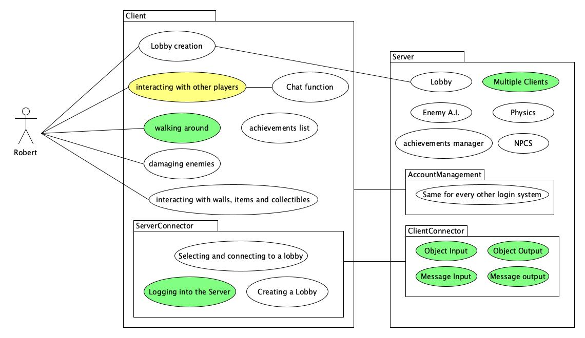
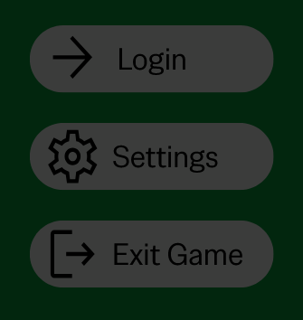
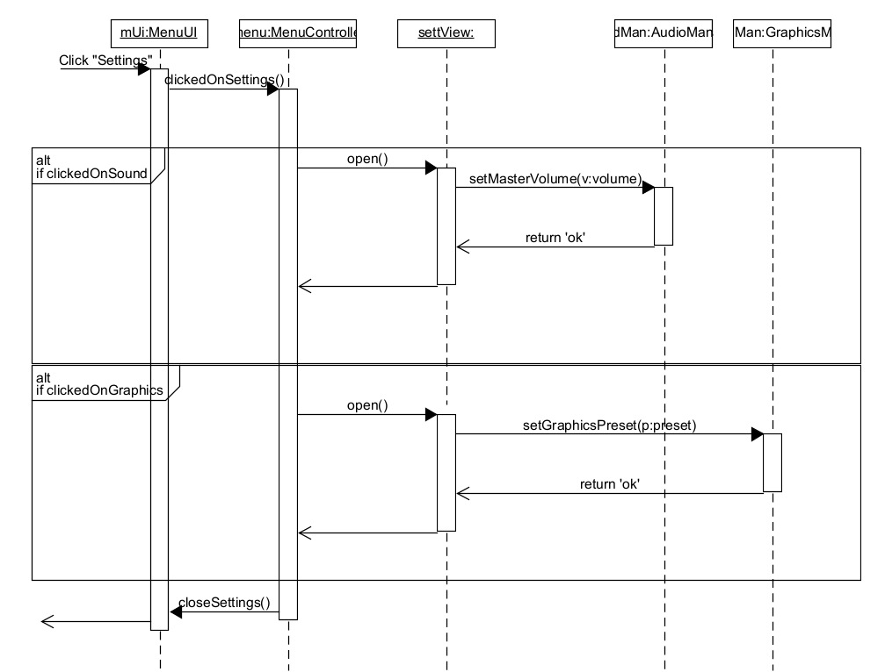
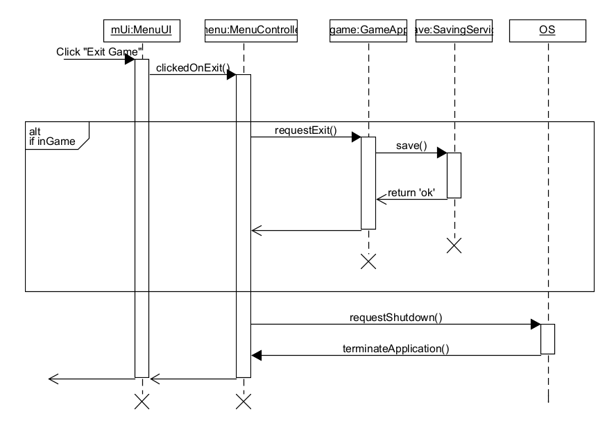
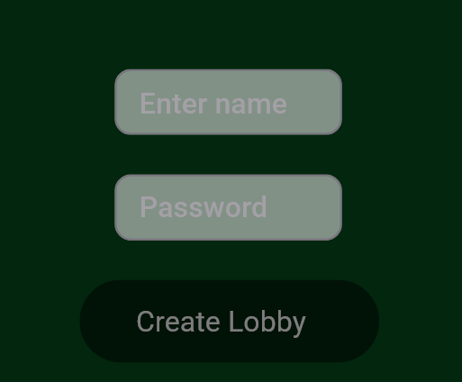
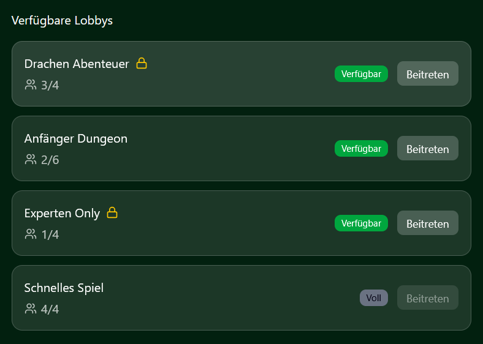
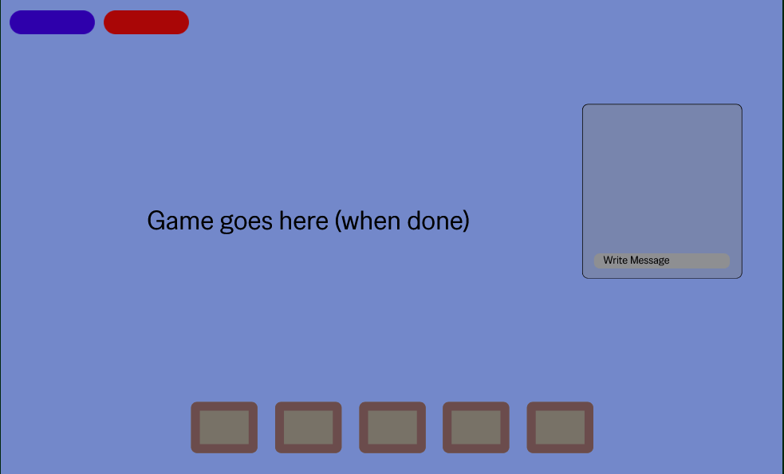

# Clandestine Dungeons
## Einleitung
### Übersicht
Unser Spiel ist ein von anderen Rogue Like Spielen inspiriertes Abenteuer, welches mehreren Spielern erlaubt zusammen zufallsgenerierte Dungeons zu erkunden. Einzigartig macht das Spiel, dass es mehr Interaktionen mit anderen Spielern erlaubt und eher teambasiert ist, im Gegensatz zu anderen Genre Vertretern.  

### Geltungsbereich
Dieses Dokument deckt nur die funktionalen und nicht-funktionalen Anforderungen ab. Dabei wird auf das Verhalten des Spiels, dessen einzelne Funktionen und Benutzerinteraktionen aber auch technische Einschränkungen eingegangen. Hardware Voraussetzungen werden nicht angesprochen.

### Definitionen, Akronyme und Abkürzungen
| Begriff  | Definition |
| ------------- | ------------- |
| GUI  | Graphical User Interface  |
| SRS  | Software Requirements Specification  |

### Referenzen
- Blog: https://github.com/RodProgrammer/dhbwrouge/discussions
- Agile Board: https://dhbwrouge.youtrack.cloud

## Funktionale Anforderungen
### Übersicht
In Clandestine Dungeons soll es für den Nutzer möglich sein:
- Eine Lobby zu erstellen oder einer beizutreten
- Mit anderen Spielern im Spiel zu interagieren
- Dungeons zu erkunden und Gegner zu bekämpfen
- Gegenstände zu nutzen

UML-Diagramm für unser Spiel:  

### Feature 1 – Menü
User Stories:
- Als Spieler möchte ich das Spiel schnell über einen Knopf im Menü schließen können.
- Als Spieler möchte ich auf die Einstellungen für Sound und Grafik zugreifen können.
- Als Spieler möchte ich mich einloggen können.

UI-Mockup für Menü:  
  

  
Sequenzdiagramm zum Ändern der Einstellungen  
 
  
Sequenzdiagramm zum Schließen des Spiels  

Links zu Sequenzdiagrammen:  
  
  

### Feature 2 – Lobby erstellen
User Stories:
- Als Spieler möchte ich eine Lobby erstellen, damit andere Spieler mir beitreten können.
- Als Spieler möchte ich die Möglichkeit haben meine Lobby mit einem Passwort zu schützen, um zu verhindern, dass ungewollte Spieler mir beitreten.
- 
UI-Mockup für Lobby Erstellung:  

### Feature 3 – Lobby beitreten
User Stories:
- Als Spieler möchte ich eine Liste an verfügbaren Lobbys sehen.
- Als Spieler möchte ich direkt erkennen können, wie viele Spieler in einer Lobby sind und ob sie passwortgeschützt ist.

UI-Mockup zum Lobby beitreten:  

### Feature 4 – HUD
User Stories:
- Als Spieler möchte ich meine Lebens- und Mana anzeige schnell auf dem Bildschirm erkennen können.
- Als Spieler möchte ich mein Inventar einsehen können.
- Als Spieler möchte ich, dass ich einen Textchat nutzen kann, um mit anderen Spielern zu kommunizieren.

UI-Mockup für das Ingame HUD:  

### Feature 5 – Bekämpfen von Gegnern
User Stories:
- Als Spieler möchte ich Gegner in der Spielwelt bekämpfen, um Gegenstände und Erfahrungspunkte zu erbeuten.

### Feature 6 – Erkunden der Welt
User Stories:
- Als Spieler möchte verschiedene Dungeons erkunden, um Gegner zu bekämpfen und mit der Welt zu interagieren.

## Nicht-funktionale Anforderungen
| Kategorie  | Beschreibung |
| ------------- | ------------- |
| Benutzerfreundlichkeit  | Das Spiel soll leicht zu bedienen und verständlich sein. |
| Wartbarkeit  | Updates und Bugfixes sollen einfach implementierbar sein. |
| Performance  | Die CPU/GPU-Auslastung soll möglichst gering sein, um auch auf älteren Computern performant zu sein. |

## Technische Einschränkungen
- Programmiersprache: Java
- Projektmanagement: YouTrack (Scrum)
- Versionierung: GitHub
