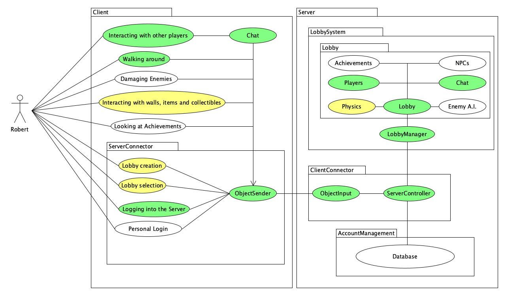
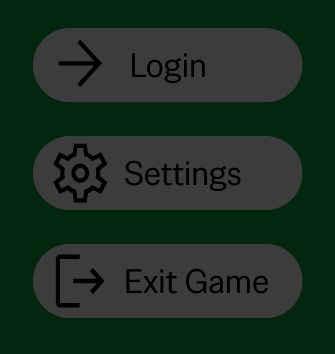
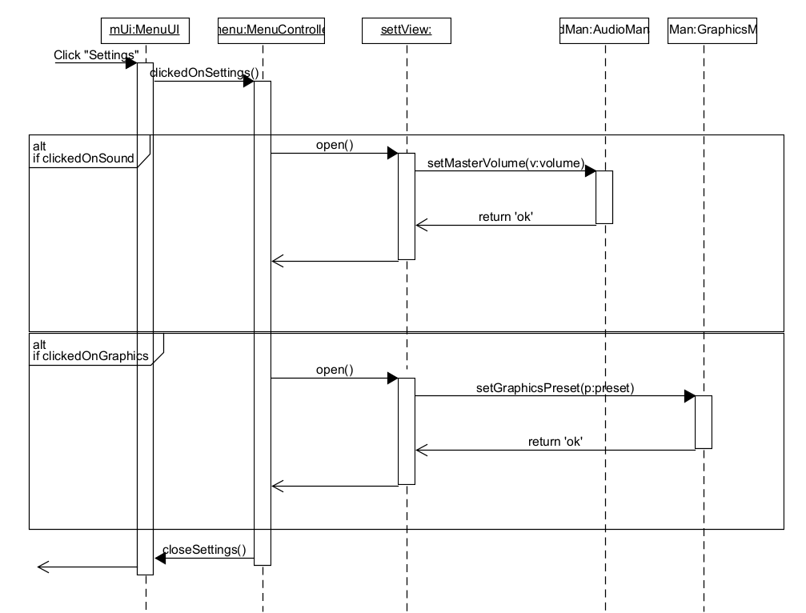
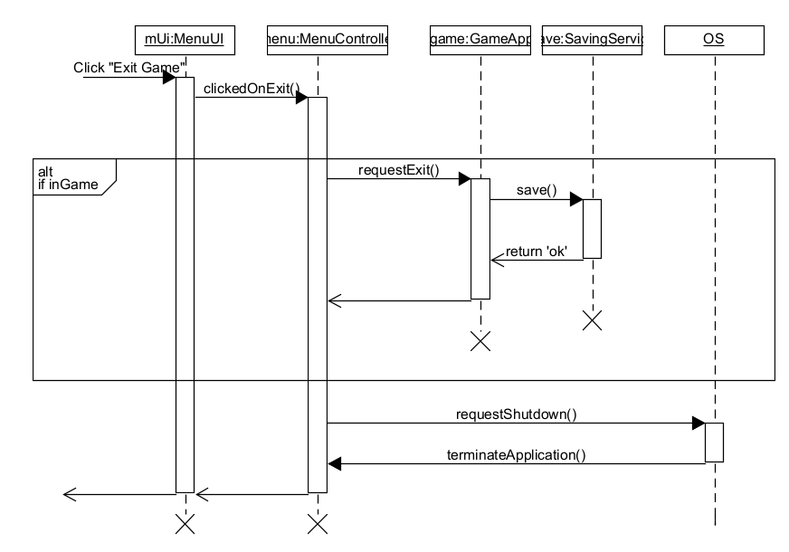
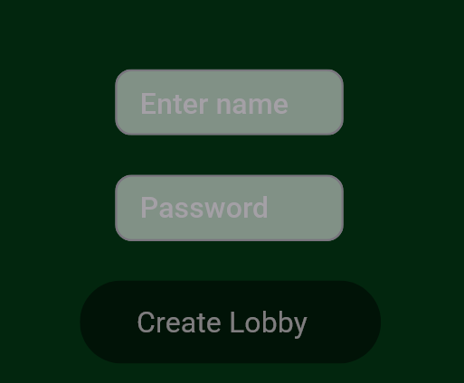
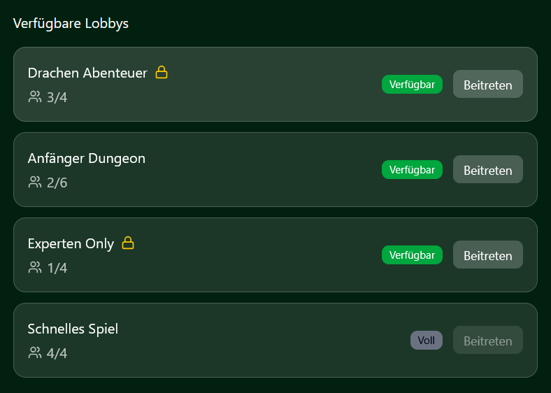
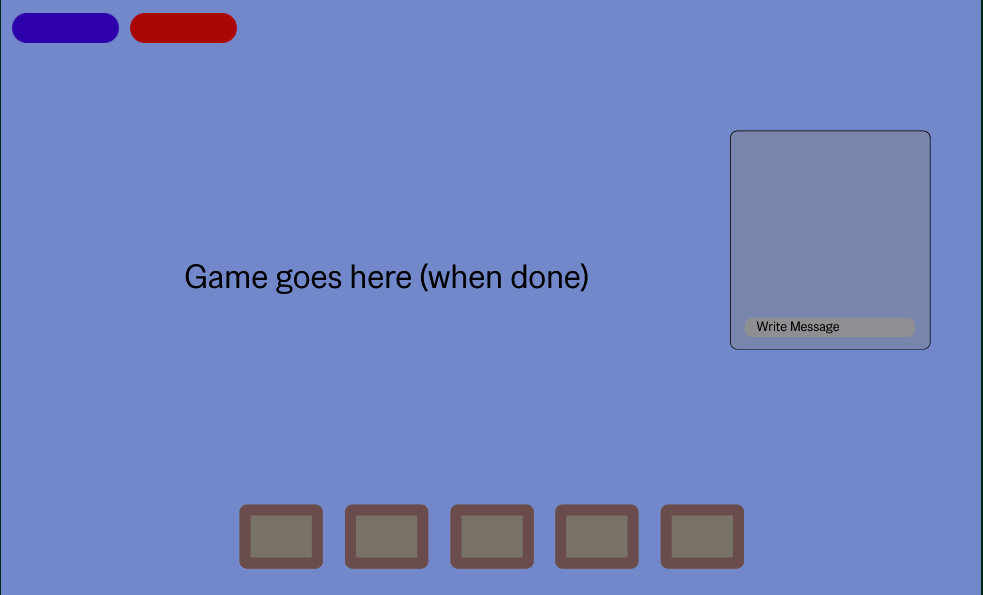
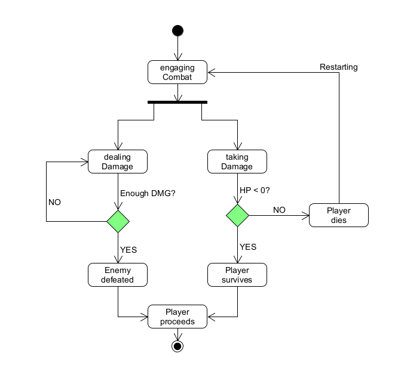
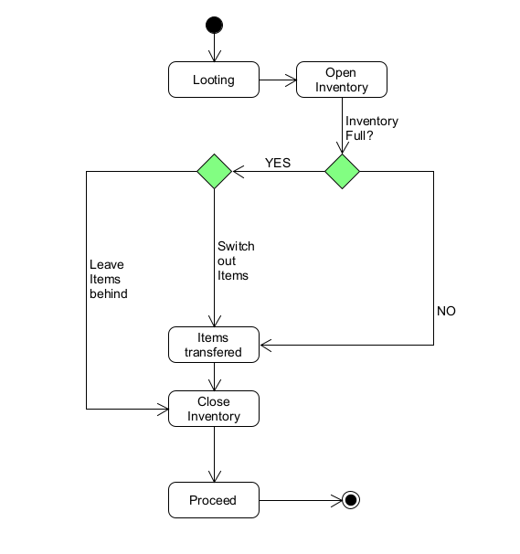
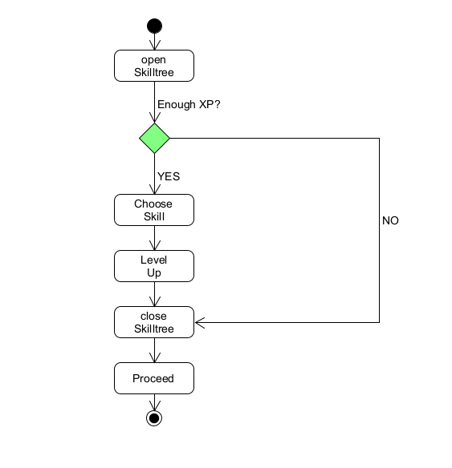

# Clandestine Dungeons
## Einleitung
### Übersicht
Unser Spiel ist ein von anderen Rogue Like Spielen inspiriertes Abenteuer, welches mehreren Spielern (bis zu 4) erlaubt zusammen zufallsgenerierte Dungeons zu erkunden. Einzigartig macht das Spiel, dass es mehr Interaktionen mit anderen Spielern erlaubt und eher teambasiert ist, im Gegensatz zu anderen Genre Vertretern.

---

### Geltungsbereich
Dieses Dokument deckt nur die funktionalen und nicht-funktionalen Anforderungen ab. Dabei wird auf das Verhalten des Spiels, dessen einzelne Funktionen und Benutzerinteraktionen aber auch technische Einschränkungen eingegangen. Hardware Voraussetzungen werden nicht angesprochen.

---

### Definitionen, Akronyme und Abkürzungen
| Begriff  | Definition | Erklärung |
| ------------- | ------------- | ------------- |
| GUI  | Graphical User Interface  | Nutzerinterface
| SRS  | Software Requirements Specification  | Dokument mit Informationen zu Anforderungen |
| DMD  | Damage | Schaden entweder am Spieler oder Gegner |
| HP  | Health Points | Lebenspunkte des Spielers oder Gegners |
| HP  | Experience Points | Erfahrungspunkte zum Erhöhen von Fähigkeiten |

---

### Referenzen
- Blog: https://github.com/RodProgrammer/dhbwrouge/discussions
- Agile Board: https://dhbwrouge.youtrack.cloud

---

## Funktionale Anforderungen
### Übersicht
In Clandestine Dungeons soll es für den Nutzer möglich sein:
- Eine Lobby zu erstellen oder einer beizutreten
- Mit anderen Spielern im Spiel zu interagieren
- Dungeons zu erkunden und Gegner zu bekämpfen
- Gegenstände zu nutzen

_UML-Diagramm für unser Spiel_  

---

### Feature 1 – Menü
#### User Story 1:
Als Spieler möchte ich das Spiel schnell über einen Knopf im Menü schließen können.
- Zeitschätzung: 4-8h
- DoD: Ein Beenden-Button existiert im Menü und schließt das Spiel sauber
- Voraussetzungen: Das Menü existiert
- Nachbedingungen: Die Anwendung ist vollständig beendet

#### User Story 2:
Als Spieler möchte ich auf die Einstellungen für Sound und Grafik zugreifen können.
- Zeitschätzung: 8-12h
- DoD: Ein Einstellungen-Button existiert im Menü und öffnet ein Panel zum Ändern der Sound/Grafik
- Voraussetzungen: Das Menü existiert, Grafik u. Sound sind konfigurierbar
- Nachbedingungen: Änderungen bleiben nach Neustart erhalten

#### User Story 3:
Als Spieler möchte ich mich einloggen können.
- Zeitschätzung: 24-36h
- DoD: Login Maske existiert im Menü, Name/Passwort kann eingeben werden, Erfolgreiche/fehlgeschlagene Logins werden korrekt behandelt
- Voraussetzungen: Benutzerverwaltung existiert, Speicher für Accounts vorhanden
- Nachbedingungen: Spielerprofil ist geladen, authentifiziert

  
_UI-Mockup für Menü_  

  
_Sequenzdiagramm zum Ändern der Einstellungen_  

Beschreibung: Durch das Klicken auf den Settingsknopf wird die MenuUI aufgerufen. Durch das auf Sound oder Graphics wird dann die jeweilige settView aufgerufen. Diese übergibt dann den in der Einstellung geänderten Wert an entweder den Audio- oder Graphicsmanager. Ist das erfolgreich wird 'ok' zurückgegeben und die Settings können geschlossen werden.  
 
  
_Sequenzdiagramm zum Schließen des Spiels_  

Beschreibung: Durch das Klicken auf den "Exit Game"-Button wird der MenuController aufgerufen, welcher das Verlassen des Spiels bei der GameApplication aufruft, sollte man sich im Spiel befinden. Diese speichert den Stand des Spiels mit dem SavingService und gibt bei Erfolg 'ok' zurück. Schlussendlich fragt der MenuController das Schließen der Applikation beim OS an und wird terminated.

Links zu Sequenzdiagrammen:  
  
  

---

### Feature 2 – Lobby erstellen
#### User Story 4:
Als Spieler möchte ich eine Lobby erstellen, damit andere Spieler mir beitreten können.
- Zeitschätzung: 16-24h
- DoD: Spieler kann eine Lobby erstellen, diese erscheint in einer Liste
- Voraussetzungen: Lobbyverwaltung existiert, Netzwerkarchitektur ist vorhanden
- Nachbedingungen: Lobby ist aktiv, Lobbyersteller ist Host

#### User Story 5:
Als Spieler möchte ich die Möglichkeit haben meine Lobby mit einem Passwort zu schützen, um zu verhindern, dass ungewollte Spieler mir beitreten.
- Zeitschätzung: 8h
- DoD: Passwort kann beim Erstellen gesetzt werden
- Voraussetzungen: Lobbysystem existiert
- Nachbedingungen: Nur Spieler mit dem korrekten Passwort können beitreten

  
_UI-Mockup für Lobby Erstellung_  

---

### Feature 3 – Lobby beitreten
#### User Story 6:
Als Spieler möchte ich eine Liste an verfügbaren Lobbys sehen.
- Zeitschätzung: 8-16h
- DoD: verfügbare Lobbys werden angezeigt, Liste kann aktualisiert werden
- Voraussetzungen: Lobbysystem existiert, Lobbys werden zentral gesammelt
- Nachbedingungen: Spieler kann eine Lobby auswählen
  
#### User Story 7:
Als Spieler möchte ich direkt erkennen können, wie viele Spieler in einer Lobby sind und ob sie passwortgeschützt ist.
- Zeitschätzung: 4-8h
- DoD: Spieleranzahl wird angezeigt, vorhandenes Passwort wird mit Symbol dargestellt
- Voraussetzungen: Lobbysystem existiert
- Nachbedingungen: Spieler kann eine Lobby besser einschätzen
  

  
_UI-Mockup zum Lobby beitreten_  

---

### Feature 4 – HUD
#### User Story 8:
Als Spieler möchte ich meine Lebens- und Manaanzeige schnell auf dem Bildschirm erkennen können.
- Zeitschätzung: 8h
- DoD: Lebens- und Manaanzeige sind sichtbar, Werte werden in Echtzeit aktualisiert
- Voraussetzungen: Charakterwerte existieren, HUD-System vorhanden
- Nachbedingungen: Spieler sieht jederzeit seinen Status

#### User Story 9:
Als Spieler möchte ich mein Inventar einsehen können.
- Zeitschätzung: 16h
- DoD: Inventar kann geöffnet/geschlossen werden, Gegenstände werden dargestellt, Unterschied zw. belegten und nicht belegten Slots ist erkennbar
- Voraussetzungen: Inventarsystem existiert, Gegenstände existieren
- Nachbedingungen: Spieler kann seine Gegenstände verwalten

#### User Story 10:
Als Spieler möchte ich, dass ich einen Textchat nutzen kann, um mit anderen Spielern zu kommunizieren.
- Zeitschätzung: 8-18h
- DoD: Nachrichten können versendet werden, Nachrichten werden angezeigt, Chatfenster wird angezeigt
- Voraussetzungen: Netzwerkkommunikation existiert
- Nachbedingungen: Spieler können miteinander kommunizieren

  
_UI-Mockup für das Ingame HUD_  

---

### Feature 5 – Bekämpfen von Gegnern
#### User Story 11:
Als Spieler möchte ich Gegner in der Spielwelt bekämpfen, um Gegenstände und Erfahrungspunkte zu erbeuten.
- Zeitschätzung: 24-36h
- DoD: Nachrichten können versendet werden, Nachrichten werden angezeigt, Chatfenster wird angezeigt
- Voraussetzungen: Netzwerkkommunikation existiert
- Nachbedingungen: Spieler können miteinander kommunizieren

  
_UML-Aktivitätsdiagramm zum Kampfsystem_  
Beschreibung: Wenn der Spieler an einem Kampf teilnimmt, kann er Schaden (Damage, DMG) an Gegner austeilen oder einstecken. Nimmt er zu viel Schaden (HP < 0) stirbt der Spieler und es wird neugestartet. Nimmt er nicht zu viel Schaden (HP > 0) überlebt er und kann weiter spielen. Wenn er genug Schaden austeilt wird der Gegner besiegt und der Spieler kann eine weitere Aktion ausführen. Sollte dies nicht der Fall sein, stirbt der Gegner nicht.

### Feature 6 – Erkunden der Welt
#### User Story 12:
Als Spieler möchte verschiedene Dungeons erkunden, um Gegner zu bekämpfen und mit der Welt zu interagieren.
- Zeitschätzung: 48-96h
- DoD: Gegner können Schaden erhalten, Gegner können besiegt werden, EXP/Gegenstände werden von Gegnern fallengelassen, mind. ein Dungeon spielbar, interaktive Elemente existieren
- Voraussetzungen: Kampfsystem existiert, Gegner- und Lootsystem vorhanden, Dungeongeneration vorhanden
- Nachbedingungen: Spieler erhalten Belohnungen. Gegner werden entfernt und respawnen, Fortschritt wird gespeichert
  
  
_UML-Aktivitätsdiagramm zum Lootsystem_  
Beschreibung: Wenn der Spieler sich entscheidet etwas (Truhe, Gegner) zu looten, öffnet sich das Inventar. Sollte dieses voll sein kann er/sie Gegenstände austauschen oder zurücklassen. Nach beiden dieser Aktionen werden Gegenstände übertragen, da Platz im Inventar vorhanden ist. Danach wir das Inventar geschlossen. Bei nicht vollem Inventar werden einfach die Gegenstände übertragen und das Inventar geschlossen. Der Spieler kann weitere Aktionen danach ausführen.

---

### Feature 7 - Skillsystem mit Skilltree
#### User Story 13:
Als Spieler möchte ich meinen Character leveln können, um immer weiter zu kommen.
- Zeitschätzung: 24-36h
- DoD: Erfahrungspunkte werden gesammelt, Levelaufstieg erfolgt automatisch, Werte des Spielers verbessern sich
- Voraussetzungen: Erfahrungspunktesystem existiert, Attribute eines Spielers sind definiert
- Nachbedingungen: Spieler bekommt ein höheres Level, bessere/neue Werte stehen zur Verfügung

  
_UML-Aktivitätsdiagramm zum Skillsystem_  
Beschreibung: Wenn der Spieler den Fähigkeitsbaum öffnet und genug XP hat, kann er eine Fähigkeit auswählen, diese aufleveln. Dann kann der Baum geschlossen werden. Sollte er/sie nicht genug XP haben wird der Baum geschlossen. Der Spieler kann weitere Aktionen danach ausführen.

---

## Nicht-funktionale Anforderungen
| Kategorie  | Beschreibung |
| ------------- | ------------- |
| Benutzerfreundlichkeit  | Das Spiel soll leicht zu bedienen und verständlich sein. |
| Wartbarkeit  | Updates und Bugfixes sollen einfach implementierbar sein. |
| Performance  | Die CPU/GPU-Auslastung soll möglichst gering sein, um auch auf älteren Computern performant zu sein. |

---

## Technische Einschränkungen
- Programmiersprache: Java
- Projektmanagement: YouTrack (Scrum)
- Versionierung: GitHub
